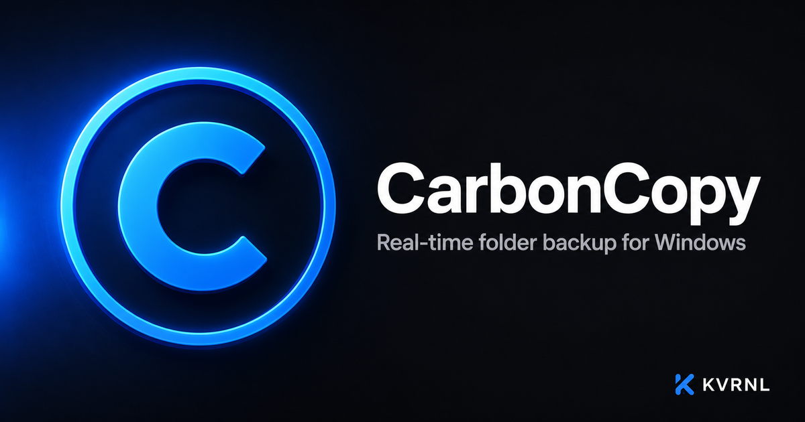

# CarbonCopy

### Real-time folder backup for Windows

 

Mirrors the folders you choose to up to three backup drives the moment anything changes. Deleted files stay recoverable, and it runs quietly in your system tray.

### **[⬇&nbsp; Download CarbonCopy — free at kvrnl.io](https://kvrnl.io/products/carbon-copy/)**

 

---

## What it does

CarbonCopy watches the folders you care about and instantly mirrors any change to up to three backup destinations — an external drive, a network drive, or another folder. A background safety-net sweep catches anything missed while you were offline.

Deleted files are kept in a dated recycle bin so accidents are recoverable, and your source folders are only ever read, never modified. Free to use — claim your license key and download it here.

## Features

- **Real-time mirroring, ~1-second sync**
- **Up to three backup destinations**
- **Recoverable deletes with a Recycle Bin**
- **Source folders are never modified**

## Download &amp; install

CarbonCopy is **completely free**. Each install needs its own license key, which you get
with a free KVRNL account.

1. Go to **[kvrnl.io/products/carbon-copy/](https://kvrnl.io/products/carbon-copy/)**
2. Create a free account — email verification, nothing else
3. Claim your license key — instant, no waiting
4. Download and install

> [!NOTE]
> CarbonCopy isn't code-signed yet, so Windows SmartScreen may warn you on first run.
> Click **More info → Run anyway**. Code signing is on the roadmap.

## Your license key

- **Free, one per product**, issued from your KVRNL account.
- **A key activates on one machine.** The first device to activate it claims it.
- **Switching computers?** Hit **Release device** on your
  [account page](https://kvrnl.io/account/) and the key is free to use again.
- Keys are checked over HTTPS at launch. See [Privacy](#privacy).

## Requirements

- **Windows 10 or 11** (64-bit)
- A free [KVRNL account](https://kvrnl.io/signup/) for your license key

## Privacy

CarbonCopy sends KVRNL only what's needed to validate your license: **the key, the
product name, and a hardware ID**. No telemetry, no analytics, no tracking, and
none of your files. Full policy: **[kvrnl.io/privacy](https://kvrnl.io/privacy/)**

## What's new

**v2.0.26** — 2026-09-26
  - CarbonCopy can now share basic usage info with KVRNL: which features get used, a daily count of files backed up, and what kind of PC it runs on. It's linked to your license key and never includes your files, their names or folder paths.
  - Crash reports and usage info share one switch in Settings, under General.

**v2.0.25** — 2026-09-25
  - CarbonCopy can now send KVRNL a short report when it runs into an error it didn't expect, so problems get fixed faster. File paths and email addresses are removed first, and nothing from inside your files is ever included. You can switch this off in Settings, under General.
  - License checks now also say which version of CarbonCopy and Windows is asking, so KVRNL can see which versions are in use and spot keys being misused.

**v2.0.24** — 2026-09-25
  - The activation window has been redesigned. It now explains exactly how to get a free key on kvrnl.io, step by step, with links to the right pages and a Paste button.
  - The activation screen is now a proper lock: nothing in CarbonCopy can be opened or run until a key is activated.
  - Your license is now stored in a protected form that can't be edited or copied to another computer. CarbonCopy still works for up to 14 days without an internet connection.
  - If your license stops being valid while CarbonCopy is running, backups stop straight away, including one already in progress, and a notification tells you what to do.
  - Clearer messages for every license problem, including how to move your key when it's already in use on another PC. Pasted keys are cleaned up automatically, and pasting an email address or a link by mistake gets a helpful hint.

**v2.0.23** — 2026-09-25
  - Updates now install reliably. CarbonCopy closes itself while an update installs, and on some PCs the installer could start before it had finished closing, then quietly give up. The app was gone, nothing was updated, and it looked like a crash. The installer now waits for CarbonCopy to finish closing.
  - When you update from Settings you see the download and install progress, and CarbonCopy opens again by itself when it's done. After any update, a notification tells you which version you're on.
  - If an update ever doesn't install, CarbonCopy tells you the next time it starts, with buttons to try again or download the installer yourself.
  - Updates are downloaded into CarbonCopy's own folder instead of the Windows temp folder, which some antivirus programs treat as suspicious.
  - Running the installer while CarbonCopy is open now closes it for you.

**v2.0.22** — 2026-09-25
  - Clicking the tray icon now opens a small control panel instead of a plain menu. It shows whether everything is backed up, what CarbonCopy is doing right now, and how each backup drive is doing, with buttons to back up now, pause or resume, open Settings, or open the full window. Left and right click both open it, and a double-click still opens the full window.
  - You can pin the panel: drag it anywhere on screen, or click its pin, and it stays open on top of your other windows, right where you put it, until you unpin it or close it with its X. It comes back in the same spot after a restart or an update.
  - When something needs your attention, the panel lists it with a button that takes you straight to the fix.
  - Resume after Pause all now turns back on only the drives that Pause switched off. A drive you had turned off yourself stays off.
  - Quit asks for a second click, so a stray click in the panel can't stop your backups.

Full history → **[kvrnl.io/changelog/carbon-copy](https://kvrnl.io/changelog/carbon-copy/)**

## Documentation

Setup guides and how-tos → **[kvrnl.io/docs/carbon-copy](https://kvrnl.io/docs/carbon-copy/)**

## Support

> [!IMPORTANT]
> **We don't use GitHub Issues.** Report bugs from inside the app — it's the
> fastest route to us and it attaches the details we need automatically.

- 🐛 **Found a bug?** Use **Report a Problem** inside CarbonCopy
- 💬 **Chat with us** → **[Discord](https://discord.gg/Ub4SdAuhu)**
- ✉️ **Anything else** → **[kvrnl.io/contact](https://kvrnl.io/contact/)**
- ❓ **FAQ** → [kvrnl.io/faq](https://kvrnl.io/faq/)

## License

**Proprietary freeware — free to use, not open source.**

This repository hosts the installer releases, documentation, and license for
CarbonCopy. **The application source code is not published.** See
**[LICENSE](./LICENSE)** for the full terms.

---

 

**[kvrnl.io](https://kvrnl.io)** &nbsp;·&nbsp; **[All products](https://kvrnl.io/products/)** &nbsp;·&nbsp; **[Changelog](https://kvrnl.io/changelog/)** &nbsp;·&nbsp; **[Discord](https://discord.gg/Ub4SdAuhu)** &nbsp;·&nbsp; **[Contact](https://kvrnl.io/contact/)**

© 2026 <b>KVRNL</b> — an AI-powered software studio shipping free desktop tools.

